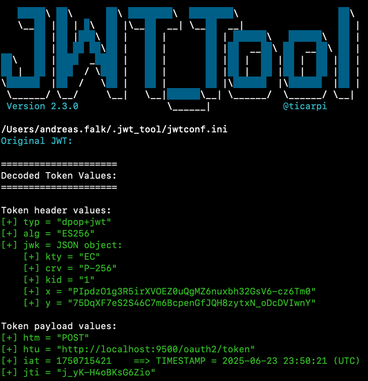
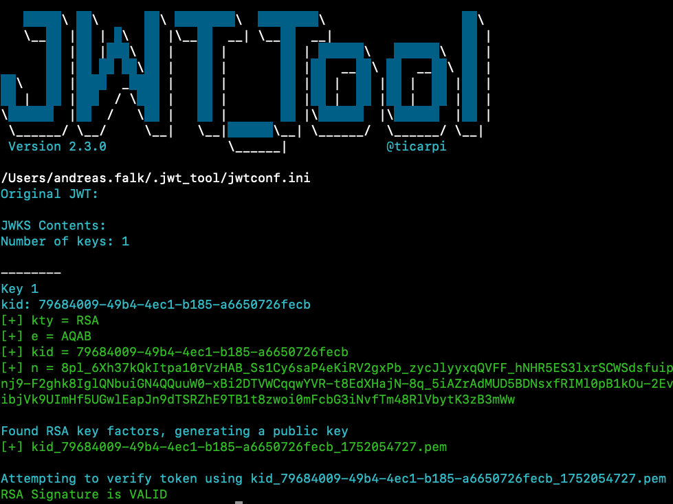
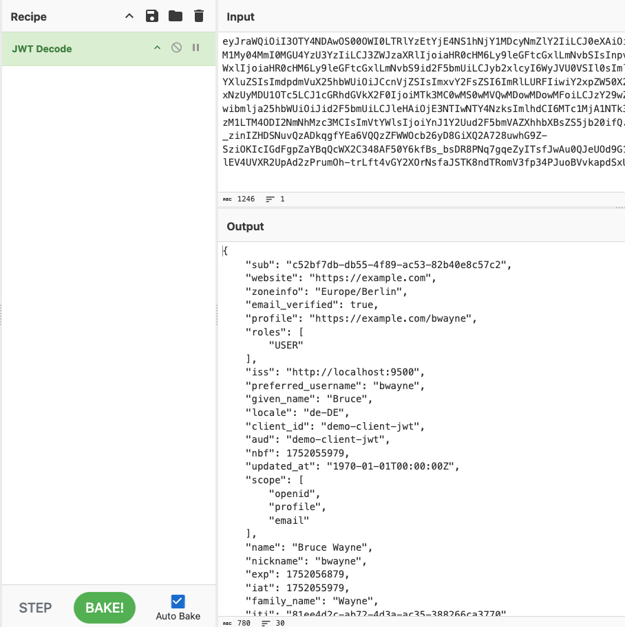

# Decode and Validate JWT

JSON Web Tokens (JWT) are, same as passwords, credentials that should be protected from being leaked to the public.
Therefore, you should NEVER paste your tokens into public online services like [JWT.io](https://jwt.io).

Instead, using locally installed offline tools are recommended for this.
In the next sections we will evaluate some available well-known tools.

## JWT-Tool

The [JWT-Tool](https://github.com/ticarpi/jwt_tool) is a python based script that is able to
* Decode and Validate JWTs
* Test for known Exploits
* Identify weak keys
* Scan for misconfigurations
* Fuzz claim values
* and much more...

### Decode JWT

To decode a JWT just perform these commands:

```bash
export TOKEN=<...Your Token...>
jwt_tool $TOKEN
```



### Validate JWT

To validate a JWT you need to provide a Public Key or JWKS file (via -pk/-jw arguments).

In case of the [Custom Spring Authorization Server](https://github.com/andifalk/custom-spring-authorization-server) copy the contents of [http://localhost:9500/oauth2/jwks](http://localhost:9500/oauth2/jwks)
to a local file named jwks.json.  
Then perform the following command on a token signed by the same authorization server:

```bash
jwt_tool $TOKEN -V -jw jwks.json
```



## Step CLI

The [Step CLI](https://github.com/smallstep/cli) is an easy-to-use CLI tool for building, operating, and automating Public Key Infrastructure (PKI) systems 
and workflows that is able to
* Sign, verify, and inspect JSON Web Tokens
* Perform authorization and single sign-on using OAuth & OIDC
* Create, revoke, validate, lint, and bundle X.509 certificates
* Create and manage SSH certificates
* and much more...

### Decode JWT

To decode a JWT just perform these commands:

```bash
export TOKEN=<...Your Token...>
echo $TOKEN | step crypto jwt inspect --insecure
```


### Validate JWT

To validate a JWT you need to provide a Public Key or JWKS file (via --key/--jwks arguments).

In case of the [Custom Spring Authorization Server](https://github.com/andifalk/custom-spring-authorization-server) copy the contents of [http://localhost:9500/oauth2/jwks](http://localhost:9500/oauth2/jwks)
to a local file named jwks.json.  
Then perform the following command on a token signed by the same authorization server:

```bash
echo $TOKEN | step crypto jwt verify --jwks jwks.json --iss "http://localhost:9500" --aud "demo-client-jwt" --alg RS256
```
## Cyber Chef

The [Cyber Chef](https://github.com/ticarpi/jwt_tool) tool is both, an online app and can be downloaded to operate as a local app (recommended).
The Cyber Chef is able to
* Sign, Decode and Validate JWTs
* Hash values
* Encrypt/Decrypt values
* Handle Public/Private Key crypto
* Format Dates
* Encode & Decode Data (Base64, ...)
* and much more...

### Decode and/or Validate JWT

To decode or validate a JWT just search for JWT related operations on the left and then _Bake_ a Recipe by double-clicking on the operation.


